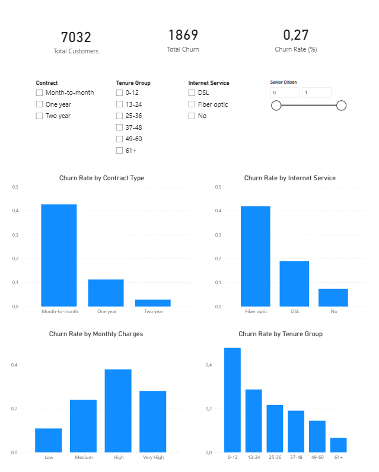

# Customer Churn Intelligence 📉📊

End-to-end analytical project focused on understanding **customer churn drivers** in a telecommunications context.  
The project combines **data preparation in Python**, **data validation**, and an **interactive Power BI dashboard** to support retention strategy analysis and executive decision-making.

---

## 📌 Business Question

What factors are most strongly associated with customer churn, and how can these insights support retention strategies?

Specifically:
- How do contract type, tenure, internet service, and billing behavior relate to churn?
- Which customer segments present the highest churn risk?
- What patterns can guide proactive retention initiatives?

---

## 📂 Dataset

- **Source:** Kaggle – Telco Customer Churn  
- **Records:** ~7,000 customers  
- **Scope:** Customer demographics, services, contracts, billing, and churn status  

---

## 🛠️ Tools & Technologies

- **Python** (Pandas, Matplotlib)
- **SQL-style validation**
- **Power BI**
  - Power Query (ETL)
  - DAX (measures & KPIs)
- **Jupyter Notebook**
- **Git & GitHub**

---

## 🔍 Analytical Process

The project follows a layered analytics approach, ensuring data quality, analytical consistency, and business clarity.

### 🔹 Data Preparation & Feature Engineering (Python)
- Exploratory Data Analysis (EDA)
- Data type corrections and cleaning
- Handling missing and incorrectly typed numerical values in billing data to ensure analytical consistency
- Feature engineering, including:
  - churn flags
  - tenure segments
  - monthly charge groupings
- Export of a BI-ready dataset

### 🔹 BI Modeling & Business Logic (Power BI)

A clear separation of responsibilities was applied:

🔹 **Business rules (Low / Medium / High groupings, categorical ordering)**  
→ resolved in **ETL (Power Query)**  

🔹 **Analytical calculations (KPIs, churn rates, aggregations)**  
→ resolved in **DAX**

This approach ensures:
- consistent behavior across visuals
- avoidance of circular dependencies
- scalable and maintainable BI modeling

---

## 📊 Key Insights

- Customers on **month-to-month contracts** show significantly higher churn rates, suggesting opportunities for retention through long-term contract incentives.
- **Early-tenure customers** (0–12 months) present the highest churn risk.
- Customers using **fiber optic internet services** exhibit higher churn compared to DSL or no internet service.
- Higher **monthly charges** are associated with increased churn probability.
- Senior citizen status and contract characteristics materially influence churn behavior.

---

## 💡 Business Interpretation

The analysis highlights churn as a **behavioral and contractual phenomenon**, not merely a demographic one.

Key strategic implications:
- Retention efforts should prioritize customers on month-to-month contracts.
- Incentives for longer-term contracts may significantly reduce churn.
- Early lifecycle engagement is critical to prevent early customer loss.
- Pricing strategy and service perception (e.g., fiber optic) warrant deeper investigation.

---

## 📊 Power BI Dashboard

The Power BI dashboard provides an **executive-level churn monitoring view**, allowing stakeholders to:

- Track total customers, total churn, and churn rate
- Analyze churn by:
  - contract type
  - tenure group
  - internet service
  - monthly charges
- Interactively filter customer segments to identify high-risk profiles

📌 *Dashboard Preview:*  

---

## 📁 Project Structure

The complete project structure is documented here:  
➡️ [View project structure](STRUCTURE.md)

---

## 🧠 Key Takeaways

- Prepared a **BI-ready dataset** with engineered features such as churn flags and tenure segments to support interactive dashboards.
- Applied best practices by separating **ETL logic** from **analytical calculations**.
- Translated churn drivers into actionable business insights.
- Delivered a full analytics workflow from raw data to executive storytelling.

---

*This project demonstrates my ability to structure analytical problems,ensure data quality, and communicate insights in a business-oriented and decision-driven manner.*